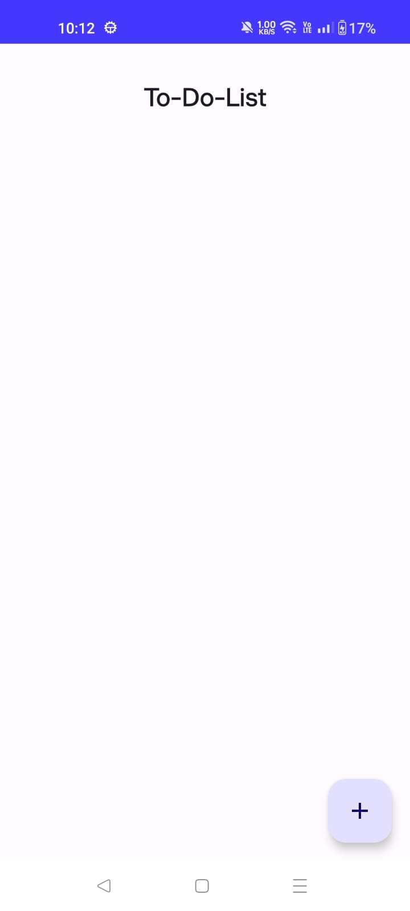
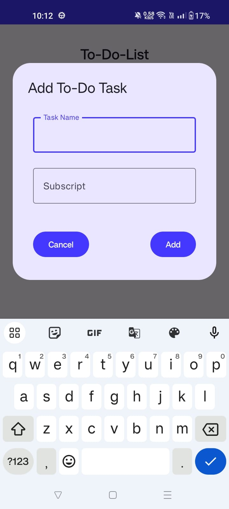
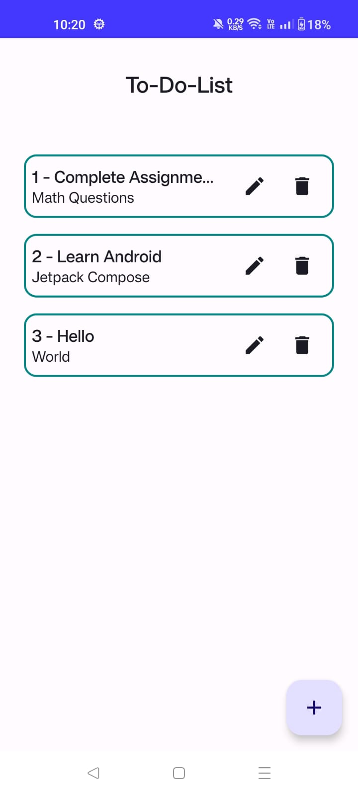
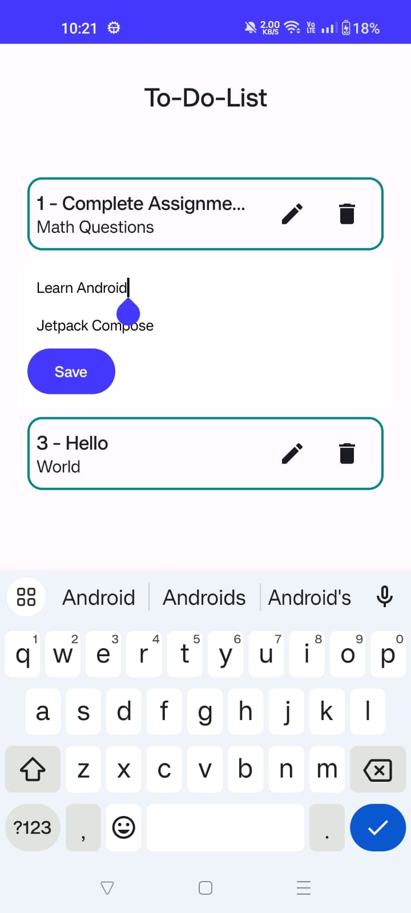
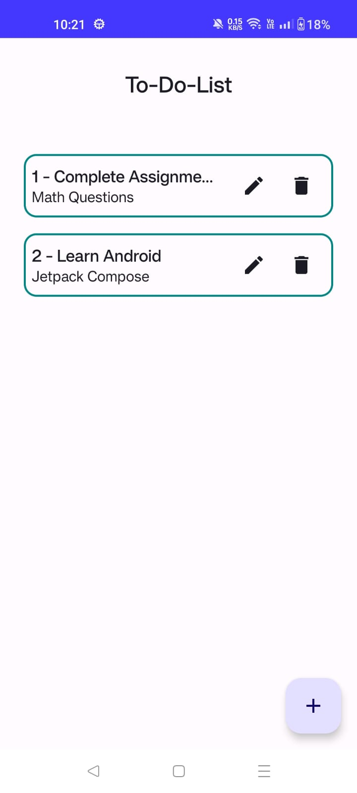

# To-Do App 

## Overview

To-Do App is a task management application designed to help you organize your daily activities and track your progress. Built with a focus on simplicity and efficiency, this app ensures you never miss a task again.

## Features

- **Task Management**: Create, update, and delete tasks easily.
- **User-Friendly Interface**: Simple and intuitive design for a seamless user experience.

## Screenshots


### Create Task: -


### Edit Tasks: -

### Delete Tasks: -


## Installation

### Prerequisites

- [Android Studio](https://developer.android.com/studio)
- Android device or emulator running Android 5.0 (Lollipop) or higher

### Steps

1. Clone the repository:
    ```bash
    git clone https://github.com/HydrallHarsh/To-Do-App-Prodigy.git
    ```
2. Open the project in Android Studio.
3. Build the project by clicking on `Build > Make Project`.
4. Run the app on your device or emulator by clicking `Run > Run 'app'`.

## Usage

1. Launch the To-Do App Prodigy on your device.
2. Create a new task by clicking on the `+` button.
4. View, update, or delete tasks from the main task list.

## Contributing

We welcome contributions to enhance To-Do App

## Contact

For any inquiries or feedback, please reach out at:
- Email: [Email](harsh.santwani0303@gmail.com)
- GitHub: [HydrallHarsh](https://github.com/HydrallHarsh)
